## LAB 2 - CRIAÇÃO DE AMBIENTE DE DESENVOLVIMENTO
### Referência

- **Oracle DevOps**: [https://docs.oracle.com/en-us/iaas/devops/using/devops_overview.htm#devops_overview](https://docs.oracle.com/en-us/iaas/devops/using/devops_overview.htm#devops_overview)
- **Oracle Container Engine for Kubernetes (OKE):** [https://docs.oracle.com/pt-br/iaas/Content/ContEng/Concepts/contengoverview.htm#Overview_of_Container_Engine_for_Kubernetes](https://docs.oracle.com/pt-br/iaas/Content/ContEng/Concepts/contengoverview.htm#Overview_of_Container_Engine_for_Kubernetes)

### Preparando ambiente Kubernetes e coletando informações necessárias
1. No menu no canto superior direito, em **Serviços de Desenvolvedor** (Developer Services), acesse **Kubernetes Clusters**.

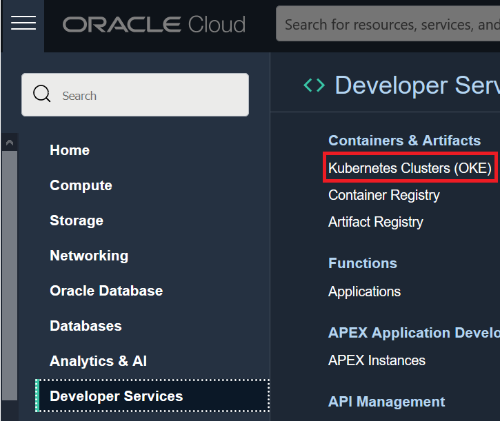

2. Certifique se de no canto esquerdo da console em **Escopo (List Scope)** o **compartimento criado nesse workshop** esta selecionado conforme imagem:

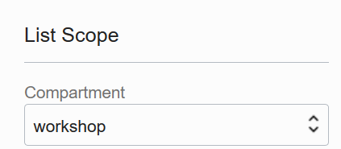

3. Repare que um cluster de nome **"oke-workshop"** já estará listado. Este cluster foi gerado a partir do terraform do laboratório 1, **selecione-o**.

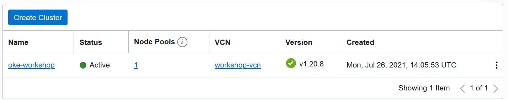

4. Na tela do cluster,clique no botão **Acessar Cluster** (Access Cluster).

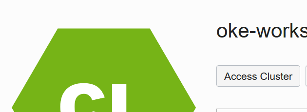

5. Certifique-se de que o **Acesso via Cloud Shell** (Cloud Shell Access) está selecionado , e execute os passos 1, e 2 do guide.

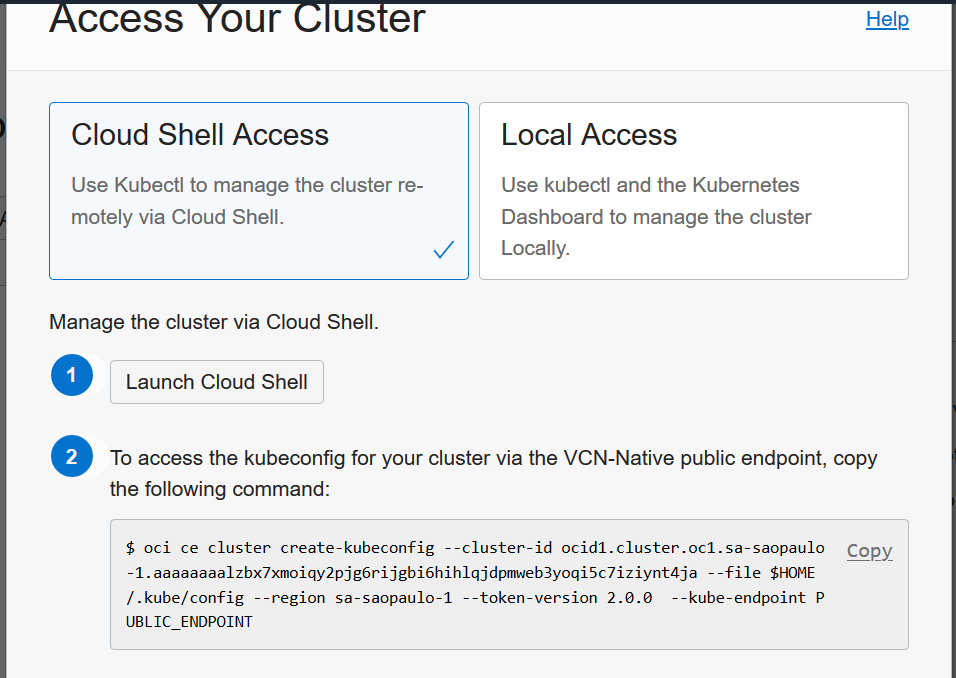

6. Ainda no Cloud Shell, execute o comando abaixo para buscar os nós presentes no cluster e validar que a conexão foi efetuada com sucesso.

    $ kubectl get nodes

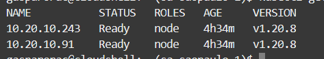

7. Navegue novamente para a pasta do projeto:

    $ cd devopsworkshopapp
    
8. Execute o script para gerar o secret necessário para que o **kubernetes** possa **acessar o repositório do Oracle Container Registry**.

    $ source createsecret.sh

9. Aguarde a criação do secret.
10. No menu no canto superior direito, em **Serviços de Desenvolvedor** (Developer Services), acesse Container Registry

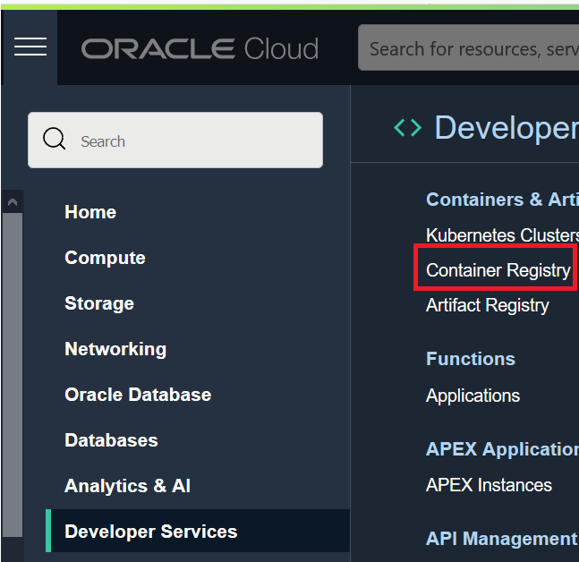

11. No canto esquerdo da console, em **Escopo** (List Scope), selecione o compartimento **(root)** da sua tenant.

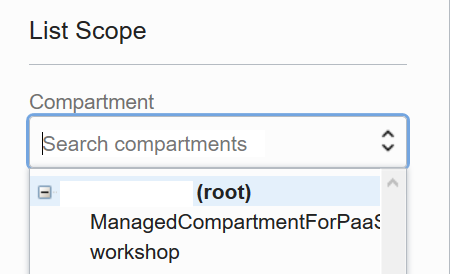

12. Expanda o container **"devopsworkshop/devopsapp"** e selecione o item **latest**

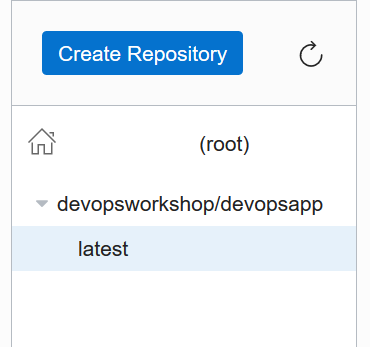

13. Copie a informação de **Full Path** para o bloco de notas.

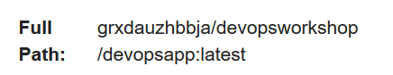

### Criando projeto utilizando Oracle DevOps
14. No menu no canto esquerdo superior, em **Serviços de Desenvolvedor** (Developer Services), acesse **DevOps**.

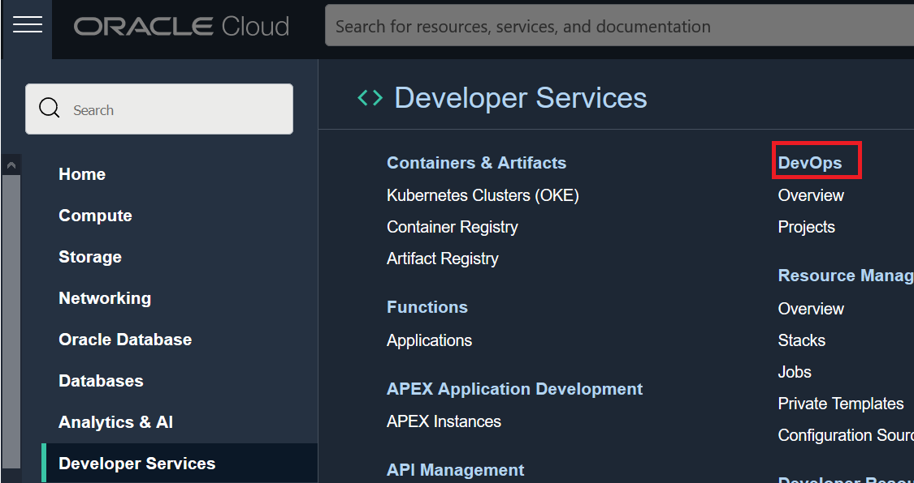

15. No canto esquerdo da console, em **Escopo** (List Scope), selecione novamente o compartimento do criado para esse workshop.

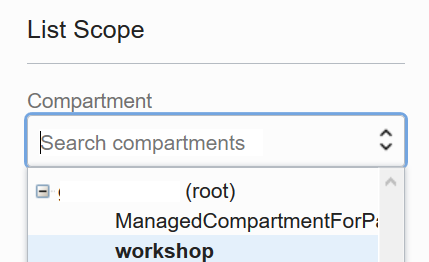

16. No canto esquerdo, em **DevOps Projects**, selecione **Projetos**(Projects).

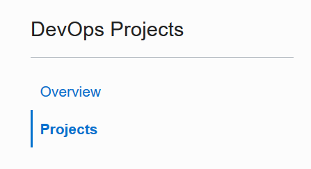

17. Clique em **Criar Projeto DevOps** (Create DevOps project).

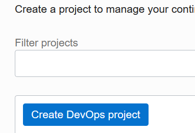

18. No formulário de criação de novo projeto, preencha da seguinte forma:
 - **Nome do Projeto** (Project Name): < Defina um nome para seu projeto >
 - Em Topicos, clique em **Selecionar Topico** (Select Topic), e no formulário de seleção de Topico, selecione o **compartimento** criado para o workshop, e o topico **devops_notification_topic**. *(O topico de notificação foi gerado a partir do terraform executado no primeiro laboratório)*

19. Clique em **Criar Projeto DevOps** (Create DevOps project)
20. Na página do projeto, no canto esquerdo em **Recursos de Projeto DevOps** (DevOps Project Resources), selecione **Logs**

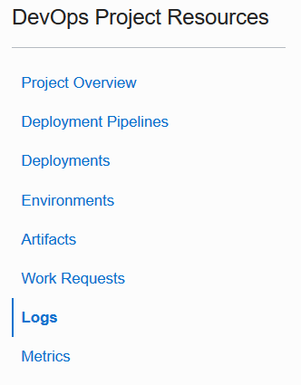

21. Na tabela de Logs, na coluna **Ativar log** (Enable Log), clique no **botão/toggle/switch** para habilitar o log.
22. No formulário de habilitação de Log preencha da seguinte forma:
- **Compartimento** (Compartment): Selecione o compartimento criado para o workshop
- Selecione **Criar novo Grupo de Log** (Create a new Log Group) para que o formulário de criação de log group apareça.
- **Nome** (Name): < Defina um nome para o Grupo de Log >
- **Descrição** (Description): < Defina uma descrição para o Grupo de Log>
- **Nome do Log** (Log Name): < Defina um nome para o Log >
- **Retenção do Log** (Log Retention): 1 Mês (1 month)

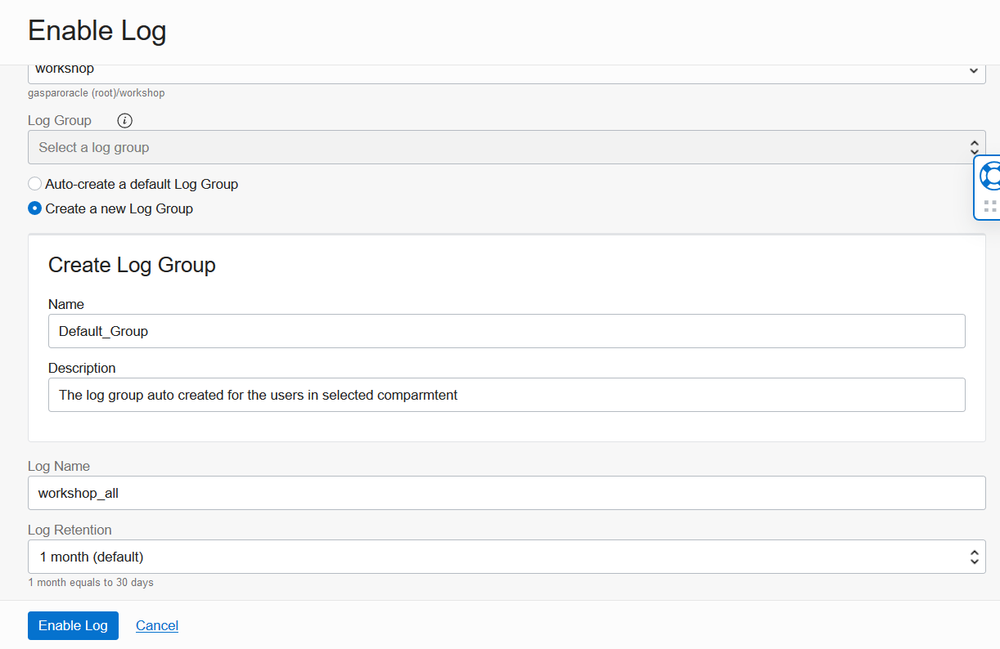

23. Clique em **Habilitar Log** (Enable Log)

### Criando ambiente de Desenvolvimento

24. Na página do projeto, no canto esquerdo em **Recursos de Projeto DevOps** (DevOps Project Resources), selecione **Ambientes**(Environments)

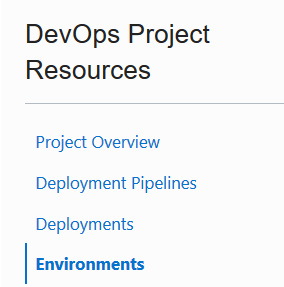

25. Clique em **Criar Ambiente** (Create environment)

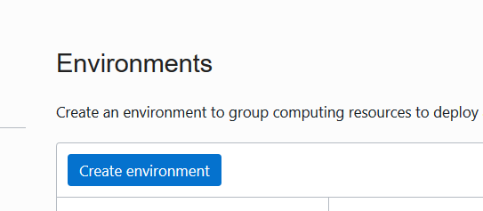

26.  No formulário de criação de ambiente preencha da seguinte forma:
- **Tipo de Ambiente** (Environment Type): Oracle Kubernetes Engine
- **Nome** (Name): Desenvolvimento
- **Descrição** (Description): Ambiente de Desenvolvimento

27. Clique em **Próximo** (Next) e preencha o formulário de Detalhes de Ambiente (Environment details) da seguinte forma:
- **Região** (Region): Selecione a sua região de registro da conta
- **Compartimento** (Compartment): Selecione o compartimento criado para esse workshop
- **Cluster**: oke-workshop

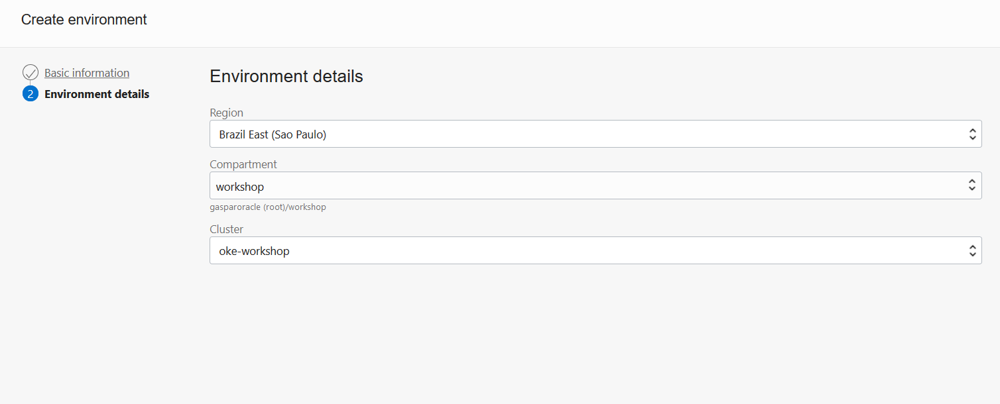

28. Clique em Criar ambiente (Create environment)

### Criando artefato de manifesto para deployment no Oracle Container Engine (OKE)

29. Retorne a página do projeto clicando **no link de mesmo nome abaixo da barra superior**

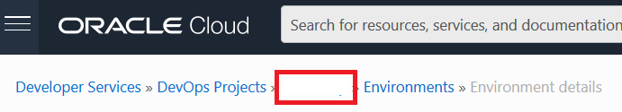

30. No canto esquerdo em **Recursos de Projeto DevOps** (DevOps Project Resources), selecione **Artefatos**(Artifacts)
31. Clique em **Adicionar Artefato** (Add artifact)

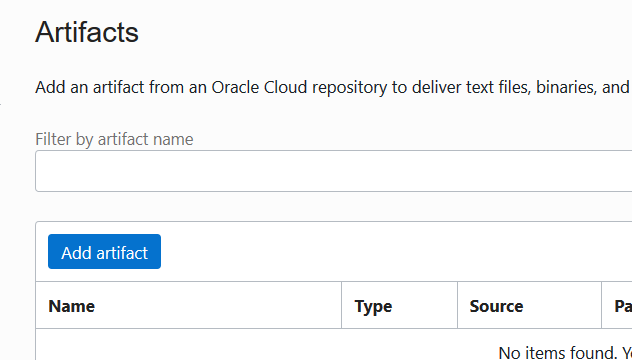

32. Preencha o formulário de adição de artefato:
- **Nome** (Name): desenvolvimento.yaml
- **Tipo** (Type): Kubernetes manifest
- **Artifact source:** Inline
- **Valor (Value):** Copie o conteúdo do arquivo [desenvolvimento.yaml](https://github.com/gustavogaspar/devopsworkshopapp/blob/main/manifests/desenvolvimento.yaml) e cole no campo de valor **[IMPORTANTE]** - Arquivos YAML são baseados em identação (espaços) para sua correta execução, **portanto não remova qualquer espaço do arquivo**.
- **Substituir parâmetros usados nesse artefato** (Replace parameters used in this artifact): Sim,... (Yes,..)

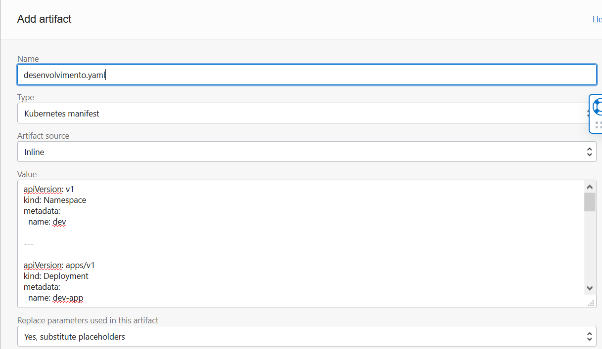

33. Clique em **Adicionar** (Add)
### Criando pipeline e executando-o pela primeira vez

34. No canto esquerdo em **Recursos de Projeto DevOps** (DevOps Project Resources), selecione **Pipelines de Deployment** (Deployment Pipelines).

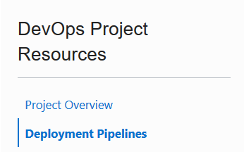

35. Clique em **Criar Pipeline** (Create pipeline)

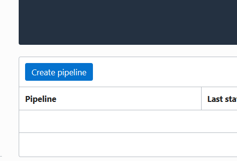

36. No formulário de criação de pipeline:
- **Nome do Pipeline** (Pipeline name): < Defina um nome para o pipeline >

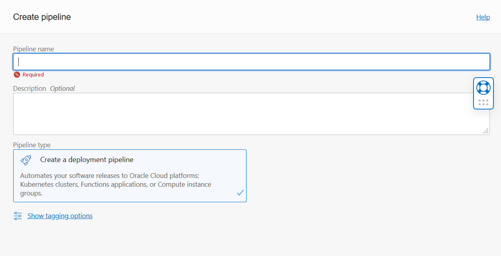

37. Clique em **Criar Pipeline** (Create pipeline)
38. Na página do recém criado pipeline, na aba **Pipeline**, clique no botão de **+ para adicionar um novo passo ao fluxo** e clique em **Adicionar Estagio** (Add Stage)

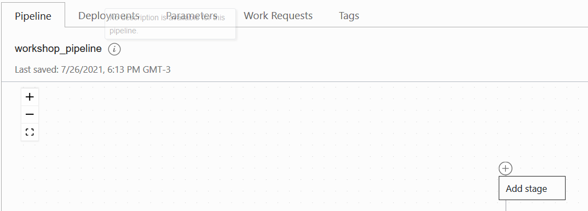

39. No formulário de adição de estagio, escolha a opção **Aplicar manifesto ao seu cluster do kubernetes** (Apply manifest to your kubernetes cluster), e clique em **Próximo** (Next)

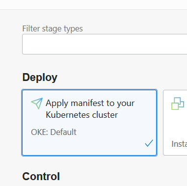

40. No formulário seguinte, preencha da seguinte forma:
- **Nome do Estágio** (Stage Name): deploy-to-dev
- **Descrição** (Description): < Defina uma descrição >
- **Ambiente** (Environment): Desenvolvimento
- Clique em **Selecionar Artefato**, e selecione o artefato **desenvolvimento.yaml**

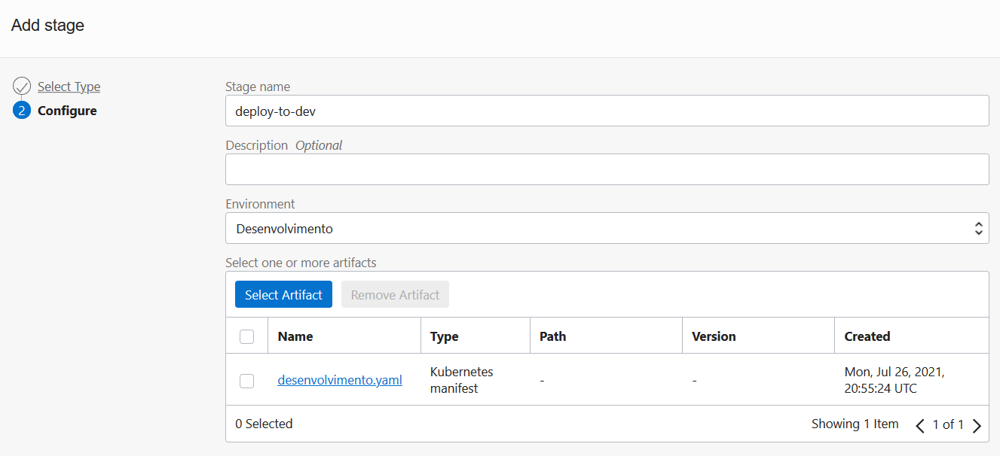

41. Clique em **Adicionar** (Add)
42. Acesse a aba **Parametros** (Parameters)

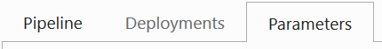

43. Defina um novo parametro com as seguintes informações:
- **Nome** (Name): IMGPATH
- **Valor por omissão** (Default value): < endpoint da sua região ref. [link](https://docs.oracle.com/pt-br/iaas/Content/Registry/Concepts/registryprerequisites.htm)>/< informação de full path coletada no passo 15 desse laboratório>.
*[IMPORTANTE] - Se preferir, você pode, a partir do Cloud Shell, executar o comando "docker images | grep ocir"  para coletar essa informação completa conforme exemplo abaixo:*

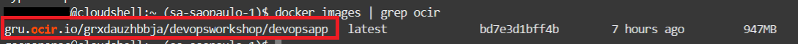

- **Descrição** (Description): Path para imagem
44. **Clique no botão de + ao lado direito da linha**
45. O resultado final deve ficar similar a imagem abaixo:

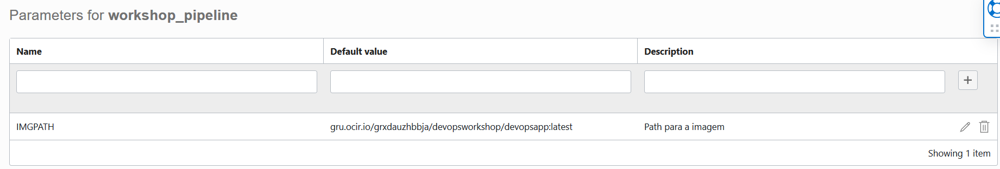

46. Retorne a **aba Pipeline**, e no canto direito clique em **Executar Pipeline** (Run Pipeline)
47. No Formulário de inicio de execução clique em **Iniciar Execução Manual** (Start Manual Run)

48. Aguarde até que a execução seja finalizada e vá ao próximo laboratório.

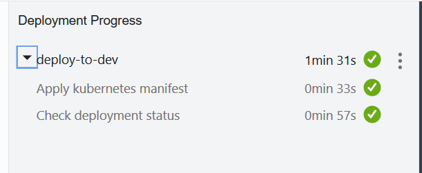

<------------- [RETORNAR](../Readme.md)