## LAB 3 - CRIAÇÃO DE AMBIENTE DE VALIDAÇÃO

  Neste laboratório exploraremos algumas das capacidades de automação que a plataforma Oracle DevOps pode entregar utilizando o Oracle Functions.

### Referência

  

- **Oracle Functions**: [https://docs.oracle.com/pt-br/iaas/Content/Functions/Concepts/functionsoverview.htm](https://docs.oracle.com/pt-br/iaas/Content/Functions/Concepts/functionsoverview.htm)

- **Oracle DevOps:** [https://docs.oracle.com/en-us/iaas/devops/using/devops_overview.htm](https://docs.oracle.com/en-us/iaas/devops/using/devops_overview.htm)

  
 
### Coletando informações necessárias

1. Na barra superior, acesse novamente o **Cloud Shell**

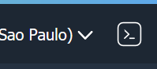

2. Execute:

    $ kubectl get svc -n dev

3. Copie a informação de **EXTERNAL-IP** para um bloco de notas

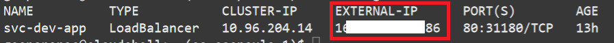

### Criando e configurando função de validação utilizando o Oracle Functions

4. No menu no canto superior esquerdo, em **Serviços de Desenvolvedor** (Developer Services), acesse Functions

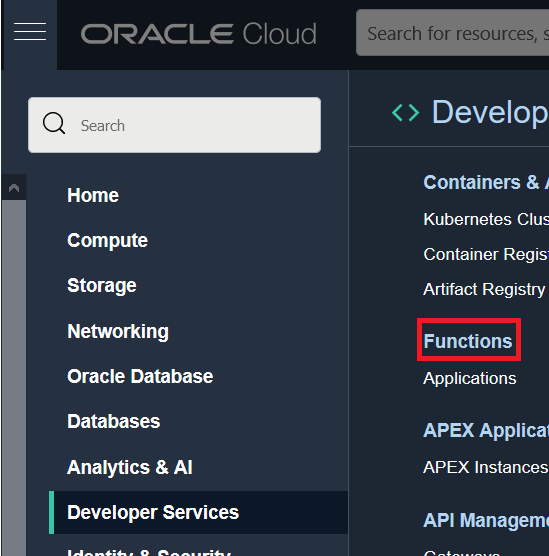

5. Certifique-se de que, no canto esquerdo, em **Escopo** (List Scope) o **compartimento criado para o workshop esta selecionado**
6. Verifique que há uma aplicação de função já criada, de nome **workshop-application**, selecione-a

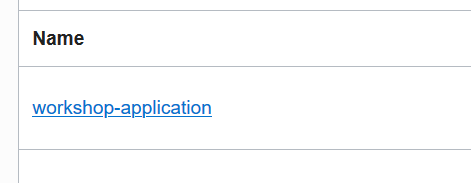

7. No canto esquerdo, em **Recursos** (Resources), acesse **Conceitos Básicos** (Getting Started)

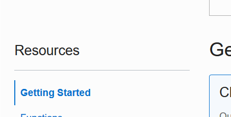

8. Selecione a opção de **Configuração do Cloud Shell** (Cloud Shell Setup).
9. Execute os passos **1, 2 e 3** da guia *(O passo 1 é necessário apenas se voce encerrou sua ultima sessão do cloud shell)*

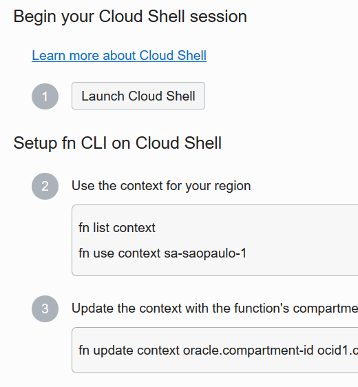

10. Execute o passo **4**  substituindo a informação entre colchetes *[OCIR-REPO]* por **fnvalidation**

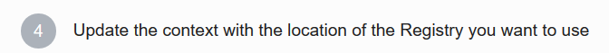

11. Agora voce vai realizar o deploy do código da função ao seu ambiente, execute no Cloud Shell:

    $ cd ~/

12. Clone o repositório do projeto executando:

    $ git clone https://github.com/gustavogaspar/validationfunction.git

13. Navegue até o diretório do projeto:

    $ cd validationfunction

14. Execute o comando abaixo para fazer o deploy da função para seu ambiente:

    $ fn -v deploy --app workshop-application

15. Aguarde a conclusão do deploy, e encerre sua sessão de Cloud Shell.
16. No canto esquerdo da página, em **Recursos** (Resources), acesse **Funções** (Functions).

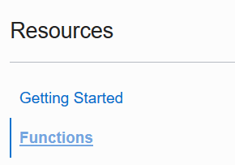

17. Verifique que uma função de nome **validation** esta listada, acesse-a.

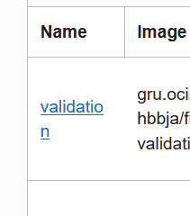

18. No canto esquerdo da página, em **Recursos** (Resources), acesse **Configuração** (Configuration).

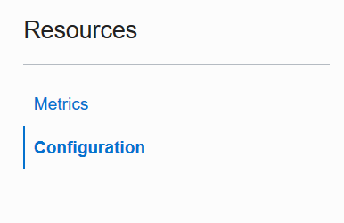

19. Adicione uma nova linha preenchendo da seguinte forma:
 
 - **Chave** (Key): APIURL
 - **Valor** (Value): **http://**< Informação de **EXTERNAL IP** coletada no inicio deste laboratório >
 
 20. Clique no sinal de  **"+"** ao lado da linha para salvar a configuração, o resultado final deve ser similar a imagem abaixo:

 
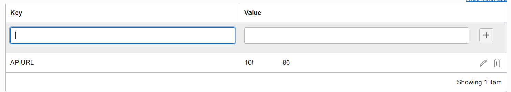

### Criando ambiente de validação

21. No menu no canto esquerdo superior, em **Serviços de Desenvolvedor** (Developer Services), acesse **DevOps>Projetos** (Projects) novamente

22. Certifique-se de que, no canto esquerdo, em **Escopo** (List Scope) o **compartimento criado para o workshop esta selecionado**
23. Selecione o projeto que você criou no laboratório anterior

24. No canto esquerdo, em **Recursos** (Resources), acesse **Ambientes** (Environments),e clique em **Criar Ambiente** (Create Environment).

25. Preencha o formulário de criação da seguinte forma:
- **Tipo de Ambiente** (Environment Type): Funções (Functions)
- **Nome** (Name): Validação

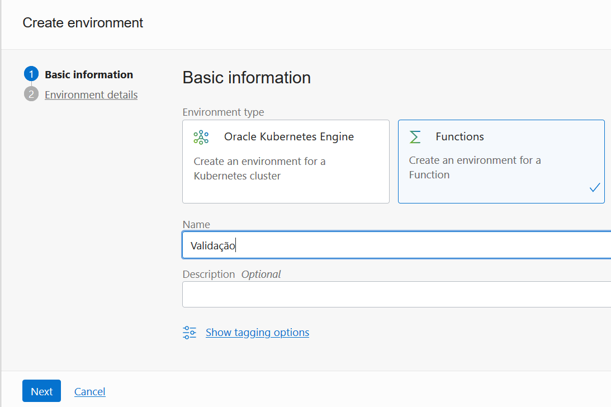

26. Clique em **Próximo** (Next)
27. Preencha o formulário seguinte da seguinte forma:
- **Região** (Region): Selecione a sua região de registro da conta
- **Compartimento** (Compartment): Selecione o compartimento criado para esse workshop
- **Aplicação** (Application): workshop-validation
- **Função** (Function): validation

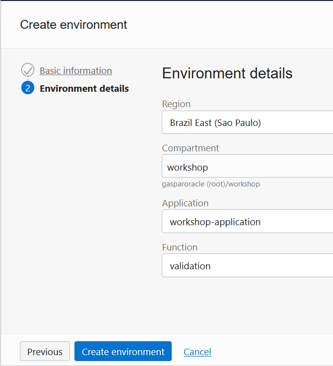

28. Clique em criar **Ambiente** (Create Environment)
### Adicionando passo de validação ao pipeline do projeto e executando o pipeline novamente

29. Retorne a página do projeto clicando **no link de mesmo nome abaixo da barra superior**

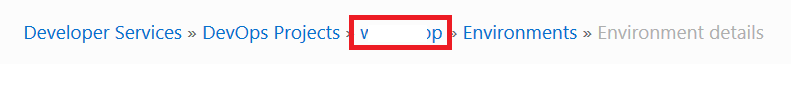

30. Selecione o **pipeline criado no laboratório anterior**:

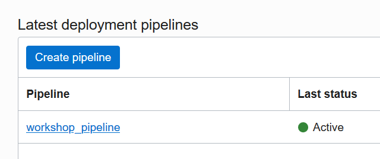

31. Abaixo da etapa criada no ultimo laboratório, clique no sinal de **"+"**, e em **Adicionar Etapa** (Add Stage) :

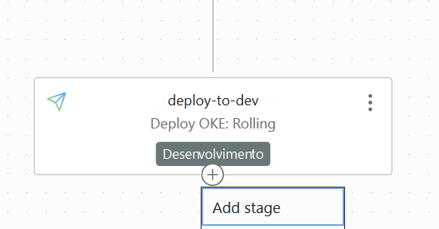

32. No Formulário de criação de etapa, selecione **Executar uma lógica personalizada por meio de uma função** (Run a custom logic through a function)

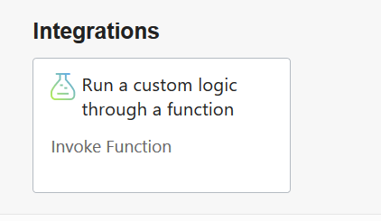

33. Clique em **Próximo** (Next)
34. No seguinte formulário, preencha da seguinte forma:
- **Nome do estágio** (Stage Name): api-test
- **Ambiente** (Environment): Validação
- **Não selecione nenhum artefato**
- **Modo de execução do estágio** (Stage run mode): **Executar de modo síncrono** (Run synchronously)
- **Validação** (Validation): **Ativar Validação** (Enable validation)

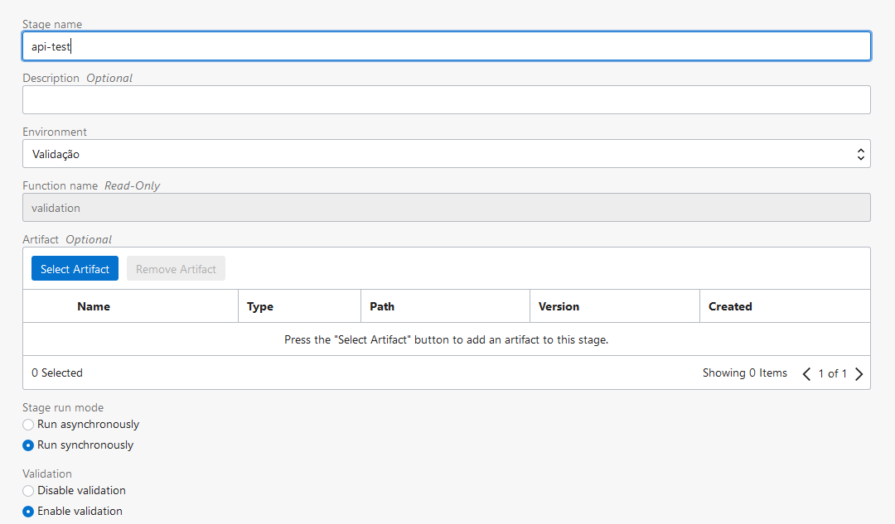

35. Clique em **Adicionar** (Add)
36. No canto direito, clique em **Executar Pipeline** (Run Pipeline)

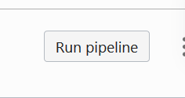

37. Clique em **Iniciar Execução Manual** (Start Manual Run)

Neste momento, a função criada realizará uma chamada na API do deployment que você criou no laboratório passado, essa API retorna *{ status: true }* quando chamada em seu contexto raiz "/", e *{ status: false }* quando chamada em seu contexto "/fail". A função então valida o retorno e devolve a plataforma de DevOps um valor booleano (true/false) dependendo do status gerado pela API.

Se você tiver interesse em testar uma falha na validação, basta refazer o passo 19 deste laboratório, substituindo o valor da chave APIURL para;

-  Chave (Key): APIURL
 - Valor (Value): **http://**< Informação de **EXTERNAL IP** coletada no inicio deste laboratório >/fail
