## LAB 4 - CRIAÇÃO DE AMBIENTE DE PRODUÇÃO

### Referência
-  **Oracle DevOps**: [https://docs.oracle.com/en-us/iaas/devops/using/devops_overview.htm#devops_overview](https://docs.oracle.com/en-us/iaas/devops/using/devops_overview.htm#devops_overview)

### Criando ambiente de produção
1.  No menu no canto esquerdo superior, em **Serviços de Desenvolvedor** (Developer Services), acesse **DevOps>Projetos** (Projects)

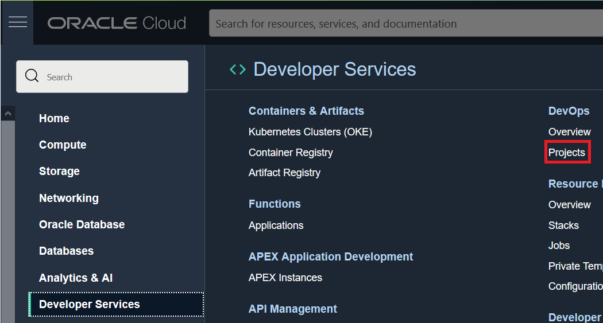

2. Certifique-se de que, no canto esquerdo, em **Escopo** (List Scope) o **compartimento criado para o workshop esta selecionado**
3. Selecione o projeto criado a partir desse workshop:

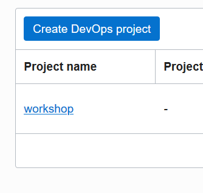

4. No canto esquerdo, em **Recursos** (Resources), acesse **Ambientes** (Environments)

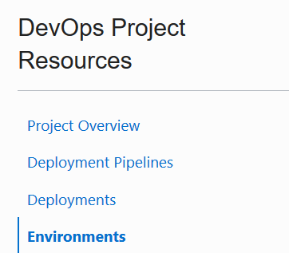

5. Clique em **Criar Ambiente** (Create Environment)
6. No formulário de criação de ambiente, preencha da seguinte forma:
- **Tipo de Ambiente** (Environment type): Oracle Kubernetes Engine
- **Nome** (Name): Produção

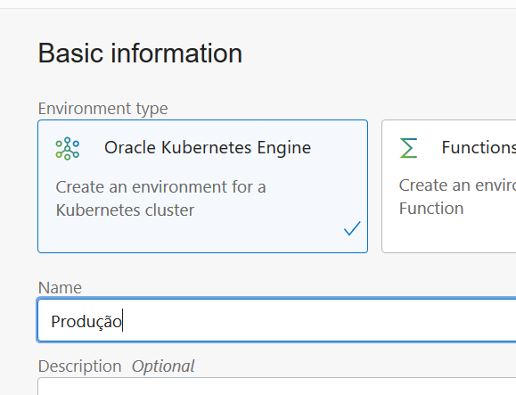

7. Clique em **Próximo** (Next)
8. Preencha o formulário seguinte usando as seguintes informações:
-  **Região** (Region): Selecione a sua região de registro da conta
-  **Compartimento** (Compartment): Selecione o compartimento criado para esse workshop
-  **Cluster**: oke-workshop

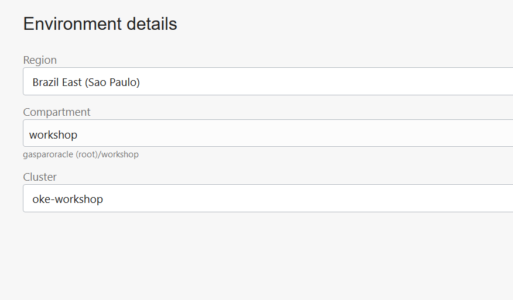

9. Clique em **Criar Ambiente** (Create Environment)

### Criando artefato de manifesto para produção
10. Retorne a página do projeto clicando **no link de mesmo nome abaixo da barra superior**

11. No canto esquerdo, em **Recursos** (Resources), acesse **Artefatos** (Artifacts)

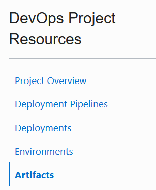

12. Clique em **Adicionar Artefato** (Add Artifact)
13. No formulário de criação de artefato, preencha da seguinte forma:
- **Nome** (Name): producao.yaml
- **Tipo** (Type): Manifesto Kubernetes (Kubernetes Manifest)
- Copie o conteúdo do arquivo [producao.yaml](https://github.com/gustavogaspar/devopsworkshopapp/blob/main/manifests/producao.yaml) e cole no campo de valor **[IMPORTANTE]** - Arquivos YAML são baseados em identação (espaços) para sua correta execução, **portanto não remova qualquer espaço do arquivo**.
- **Substituir parâmetros usados nesse artefato** (Replace parameters used in this artifact): Sim,... (Yes,..)

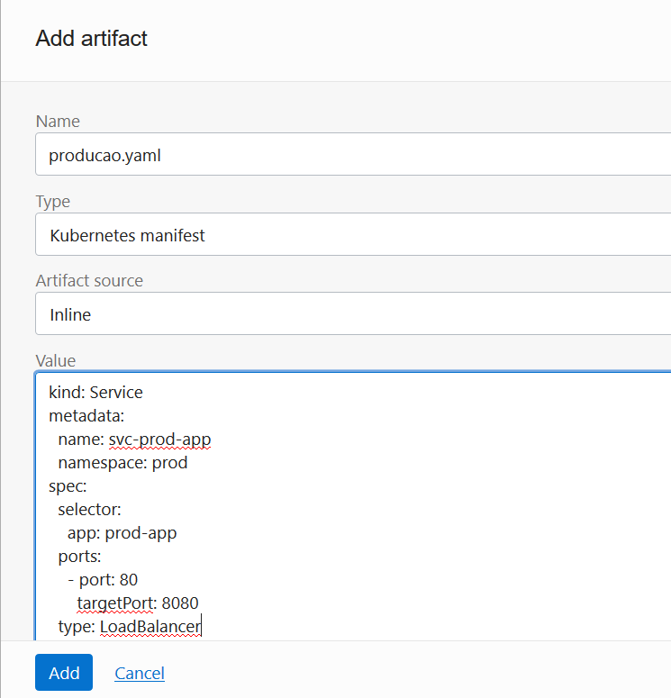

14. Clique em **Adicionar** (Add)

### Adicionando passo de deploy em produção ao pipeline do projeto e executando o pipeline novamente

15. No canto esquerdo, em **Recursos** (Resources), acesse **Pipelines de Deployment** (Deployment Pipelines)

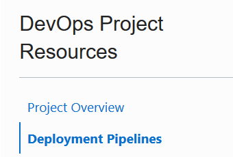

16. Selecione o pipeline criado neste workshop

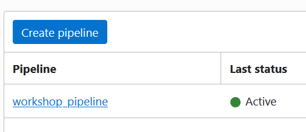

17. Abaixo da etapa de **"api-test"** clique no sinal de **"+"** e em **Adicionar Etapa** (Add Stage)

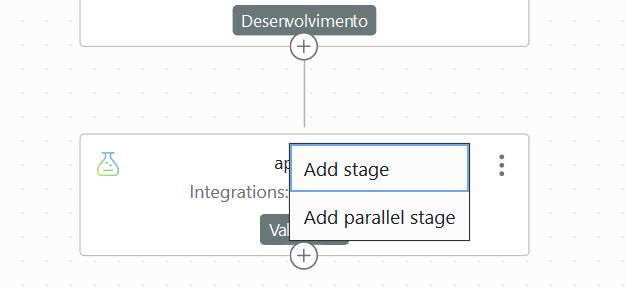

18. No formulário de adição de estágio, escolha a opção **Aplicar manifesto ao seu cluster do kubernetes** (Apply manifest to your kubernetes cluster), e clique em **Próximo** (Next)

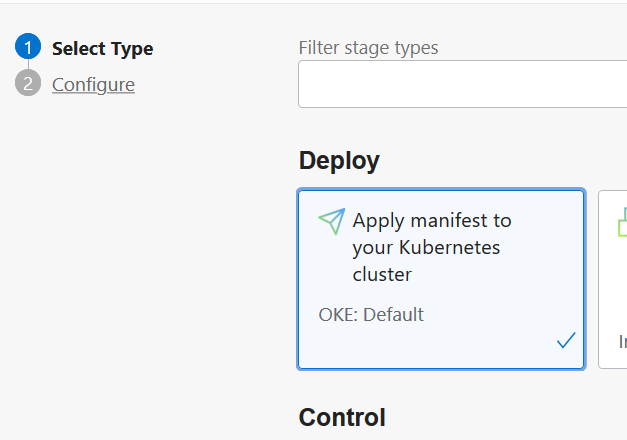

19. Preencha o próximo formulário da seguinte forma:
- **Nome de Etapa** (Stage Name): deploy-to-production
- **Environment**: Produção
- **Selecione o artefato producao.yaml**

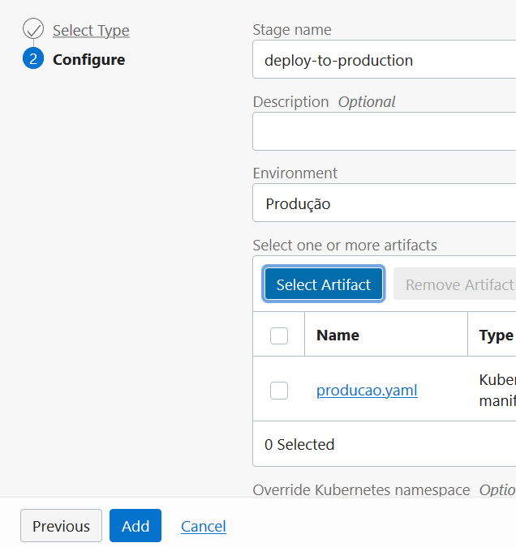

20. Clique em **Adicionar** (Add)
21. No canto direito da console, clique em **Executar Pipeline** (Run pipeline)
22. No Formulário seguinte, clique em **Iniciar Execução Manual** (Start Manual Run)

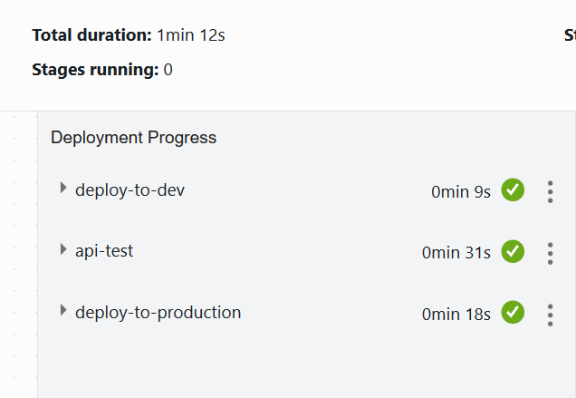

**Parabéns, você concluiu o workshop! Espero que o material tenha sido útil no seu aprendizado em Oracle Cloud Infrastructure!!**

